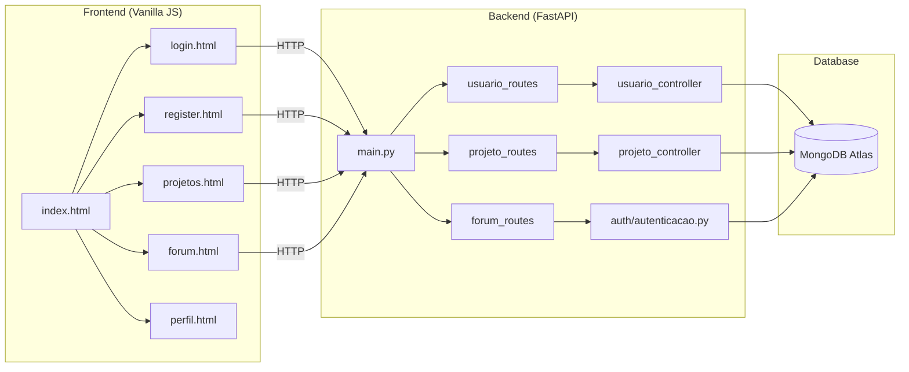
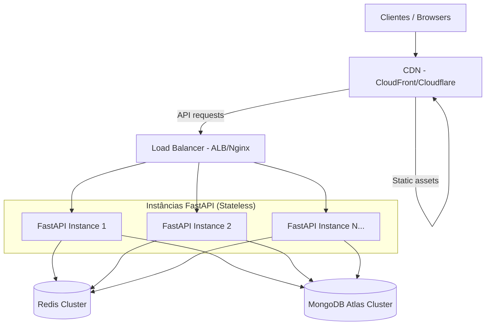
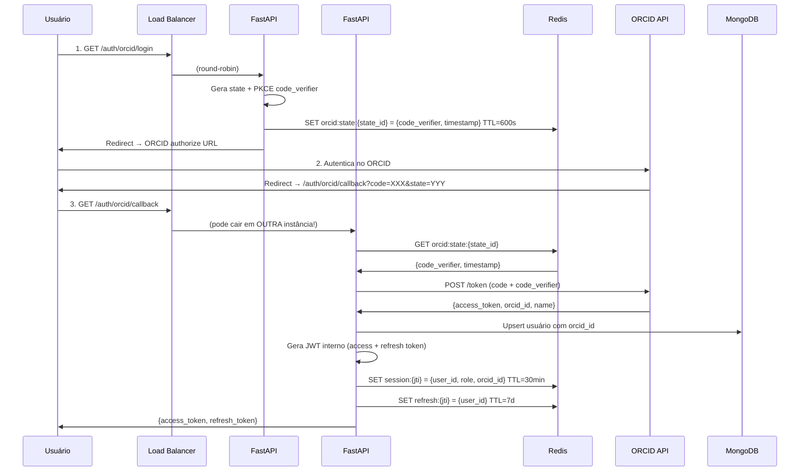
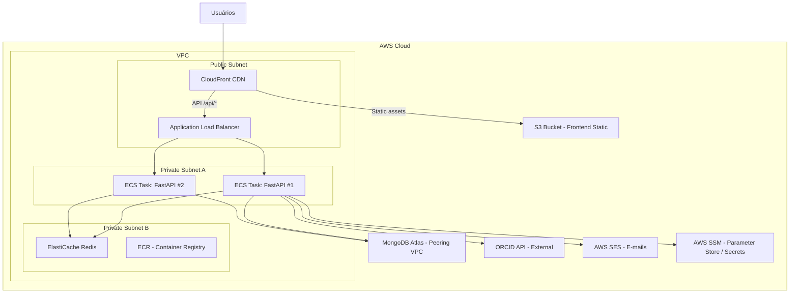
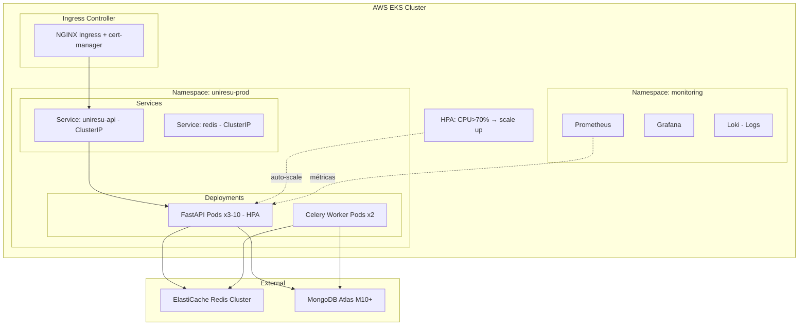
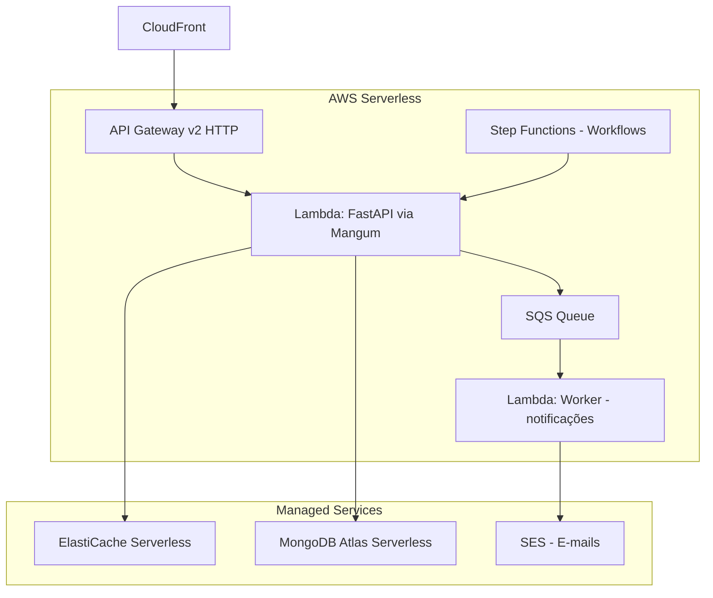
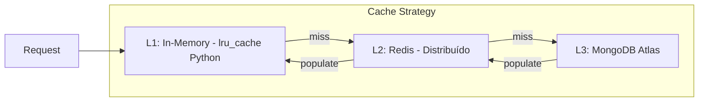
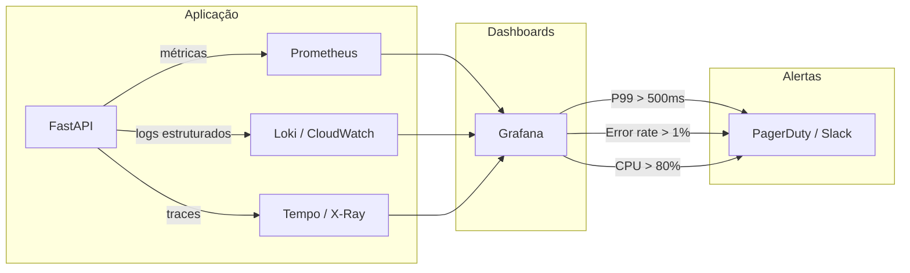
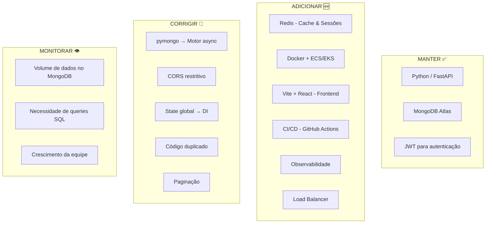

# 🏗️ Arquitetura Cloud — UniResu Connect

## Documento de Arquitetura de Software & Infraestrutura Cloud

---

## 1. Diagnóstico da Arquitetura Atual

Após análise detalhada de todo o código-fonte do projeto, identifiquei a seguinte estrutura:

### 1.1 Mapeamento dos Componentes



### 1.2 Problemas Críticos Identificados no Código

> [!CAUTION]
> Os seguintes problemas comprometem diretamente a capacidade de escalar e a segurança da aplicação.

| # | Arquivo | Problema | Impacto |
|---|---------|----------|---------|
| 1 | [connection.py](file:///c:/Users/Meu%20Computador/Downloads/UniResu-Connect-2026/UniResu-Connect-main-2.0/backend/database/connection.py) | **Estado global mutável** (`client` e `db` como variáveis globais) | Impossibilita escalar horizontalmente — cada instância tem seu próprio estado |
| 2 | [connection.py](file:///c:/Users/Meu%20Computador/Downloads/UniResu-Connect-2026/UniResu-Connect-main-2.0/backend/database/connection.py) | Usa `pymongo` (síncrono) com FastAPI (assíncrono) | Bloqueia o event loop; anula a vantagem de concorrência do FastAPI |
| 3 | [autenticacao.py](file:///c:/Users/Meu%20Computador/Downloads/UniResu-Connect-2026/UniResu-Connect-main-2.0/backend/auth/autenticacao.py) | JWT sem estratégia de revogação | Tokens comprometidos ficam válidos até expirar |
| 4 | [main.py](file:///c:/Users/Meu%20Computador/Downloads/UniResu-Connect-2026/UniResu-Connect-main-2.0/backend/main.py) | CORS com `allow_origins=["*"]` | Vulnerabilidade de segurança em produção |
| 5 | [usuario_routes.py](file:///c:/Users/Meu%20Computador/Downloads/UniResu-Connect-2026/UniResu-Connect-main-2.0/backend/routes/usuario_routes.py) | Lógica duplicada entre routes e controllers | Duplicação de `hash_password`, `verify_password`, `formatar_usuario` |
| 6 | [projeto_controller.py](file:///c:/Users/Meu%20Computador/Downloads/UniResu-Connect-2026/UniResu-Connect-main-2.0/backend/controllers/projeto_controller.py) | Queries sem paginação (`limit(50)` fixo) | Não escala com volume de dados |
| 7 | [main.py](file:///c:/Users/Meu%20Computador/Downloads/UniResu-Connect-2026/UniResu-Connect-main-2.0/backend/main.py) | `on_event("startup/shutdown")` depreciado | FastAPI moderno usa `lifespan` context manager |
| 8 | Frontend | HTML estático sem bundler/framework | Impossível otimizar assets, code-splitting, SSR/SSG |

---

## 2. Estratégia de Escalabilidade com a Stack Atual

### 2.1 Escalabilidade Vertical (Scale Up)

Otimizações para extrair o máximo de uma única instância:

#### A) Migrar pymongo → Motor (driver assíncrono)

```python
# ❌ ATUAL: pymongo síncrono — bloqueia o event loop
from pymongo import MongoClient
client = MongoClient(MONGO_URI)
db = client["UniResuDB"]

# ✅ PROPOSTO: Motor assíncrono — libera o event loop
from motor.motor_asyncio import AsyncIOMotorClient

class Database:
    client: AsyncIOMotorClient = None
    db = None

    @classmethod
    async def connect(cls):
        cls.client = AsyncIOMotorClient(MONGO_URI)
        cls.db = cls.client["UniResuDB"]

    @classmethod
    async def disconnect(cls):
        if cls.client:
            cls.client.close()

    @classmethod
    def get_db(cls):
        return cls.db
```

**Ganho:** FastAPI processa múltiplas requisições concorrentemente enquanto espera I/O do banco. Uma única instância pode atender **5-10x** mais requisições concorrentes.

#### B) Uvicorn com Workers

```bash
# Produção: múltiplos workers no mesmo servidor
uvicorn main:app --host 0.0.0.0 --port 8000 --workers 4

# Ou via Gunicorn com Uvicorn workers (recomendado)
gunicorn main:app -w 4 -k uvicorn.workers.UvicornWorker --bind 0.0.0.0:8000
```

**Ganho:** Utiliza todos os núcleos da CPU. Em um servidor com 4 cores → 4 workers → ~4x throughput.

#### C) Índices adequados no MongoDB

```javascript
// Índices essenciais para as queries atuais
db.usuarios.createIndex({ "email": 1 }, { unique: true })
db.projetos.createIndex({ "titulo": "text", "descricao": "text" })
db.projetos.createIndex({ "area_estudo": 1, "e_remoto": 1, "tipo_projeto": 1 })
db.topicos_forum.createIndex({ "data_criacao": -1 })
```

#### D) Paginação baseada em cursor

```python
# ❌ ATUAL
cursor = db.projetos.find(query_filter)
resultados = list(cursor.limit(50))

# ✅ PROPOSTO: paginação por cursor (eficiente para grandes volumes)
async def buscar_projetos(query_filter: dict, last_id: str = None, page_size: int = 20):
    if last_id:
        query_filter["_id"] = {"$gt": ObjectId(last_id)}

    cursor = db.projetos.find(query_filter).sort("_id", 1).limit(page_size)
    resultados = await cursor.to_list(length=page_size)
    return resultados
```

### 2.2 Escalabilidade Horizontal (Scale Out)



#### A) Tornar a aplicação Stateless

O princípio fundamental: **nenhuma instância deve guardar estado em memória**.

```python
# ✅ Arquitetura Stateless — cada request é autossuficiente
from contextlib import asynccontextmanager
from motor.motor_asyncio import AsyncIOMotorClient
import redis.asyncio as redis

@asynccontextmanager
async def lifespan(app: FastAPI):
    # Startup
    app.state.mongo_client = AsyncIOMotorClient(MONGO_URI)
    app.state.db = app.state.mongo_client["UniResuDB"]
    app.state.redis = redis.from_url(REDIS_URL, decode_responses=True)
    yield
    # Shutdown
    app.state.mongo_client.close()
    await app.state.redis.close()

app = FastAPI(title="UniResu API", lifespan=lifespan)
```

#### B) Gerenciamento de Sessões/Tokens JWT com Redis

> [!IMPORTANT]
> Este é o ponto mais crítico para escalar horizontalmente com autenticação ORCID.

**Fluxo de autenticação ORCID com múltiplas instâncias:**



**Implementação do gerenciamento de tokens:**

```python
import redis.asyncio as redis
from uuid import uuid4

class TokenManager:
    """Gerencia tokens JWT com Redis para suportar múltiplas instâncias."""

    def __init__(self, redis_client: redis.Redis):
        self.redis = redis_client

    async def create_session(self, user_id: str, role: str, orcid_id: str) -> dict:
        """Cria access + refresh tokens armazenados no Redis."""
        access_jti = str(uuid4())
        refresh_jti = str(uuid4())

        # Access token = 30 min
        await self.redis.setex(
            f"session:{access_jti}",
            timedelta(minutes=30),
            json.dumps({"user_id": user_id, "role": role, "orcid_id": orcid_id})
        )

        # Refresh token = 7 dias
        await self.redis.setex(
            f"refresh:{refresh_jti}",
            timedelta(days=7),
            json.dumps({"user_id": user_id, "access_jti": access_jti})
        )

        access_token = jwt.encode(
            {"sub": user_id, "jti": access_jti, "role": role, "type": "access"},
            SECRET_KEY, algorithm=ALGORITHM
        )
        refresh_token = jwt.encode(
            {"sub": user_id, "jti": refresh_jti, "type": "refresh"},
            SECRET_KEY, algorithm=ALGORITHM
        )

        return {"access_token": access_token, "refresh_token": refresh_token}

    async def validate_token(self, jti: str) -> dict | None:
        """Valida se o token ainda está ativo (não revogado)."""
        session_data = await self.redis.get(f"session:{jti}")
        return json.loads(session_data) if session_data else None

    async def revoke_token(self, jti: str):
        """Revoga um token imediatamente (logout)."""
        await self.redis.delete(f"session:{jti}")

    async def revoke_all_user_sessions(self, user_id: str):
        """Revoga TODAS as sessões de um usuário (ex: senha comprometida)."""
        async for key in self.redis.scan_iter(f"session:*"):
            data = await self.redis.get(key)
            if data and json.loads(data).get("user_id") == user_id:
                await self.redis.delete(key)
```

#### C) Balanceamento de Carga

```nginx
# nginx.conf — Load Balancer
upstream uniresu_api {
    least_conn;  # Direciona para a instância com menos conexões ativas
    server api-1:8000;
    server api-2:8000;
    server api-3:8000;

    # Health checks
    keepalive 32;
}

server {
    listen 443 ssl http2;
    server_name api.uniresu-connect.dev;

    # SSL/TLS termination
    ssl_certificate /etc/ssl/certs/uniresu.crt;
    ssl_certificate_key /etc/ssl/private/uniresu.key;

    # Rate limiting global
    limit_req_zone $binary_remote_addr zone=api:10m rate=30r/s;

    location /api/ {
        limit_req zone=api burst=50 nodelay;
        proxy_pass http://uniresu_api;
        proxy_set_header Host $host;
        proxy_set_header X-Real-IP $remote_addr;
        proxy_set_header X-Forwarded-For $proxy_add_x_forwarded_for;
        proxy_set_header X-Forwarded-Proto $scheme;
    }

    # Static assets direto do CDN/S3
    location /static/ {
        proxy_pass https://cdn.uniresu-connect.dev/;
        expires 1y;
        add_header Cache-Control "public, immutable";
    }
}
```

---

## 3. Avaliação Crítica da Stack & Sugestões

### 3.1 Matriz Comparativa

| Critério | Python/FastAPI | Node.js/Express ou Fastify | Go/Gin ou Fiber | Java/Spring Boot |
|----------|:---:|:---:|:---:|:---:|
| **Throughput (req/s)** | ⭐⭐⭐ (~15K) | ⭐⭐⭐ (~18K) | ⭐⭐⭐⭐⭐ (~100K+) | ⭐⭐⭐⭐ (~30K) |
| **Latência (p99)** | ⭐⭐⭐ | ⭐⭐⭐ | ⭐⭐⭐⭐⭐ | ⭐⭐⭐⭐ |
| **Uso de Memória** | ⭐⭐⭐ (~80MB) | ⭐⭐⭐⭐ (~50MB) | ⭐⭐⭐⭐⭐ (~15MB) | ⭐⭐ (~200MB) |
| **Ecossistema / Libs** | ⭐⭐⭐⭐⭐ | ⭐⭐⭐⭐⭐ | ⭐⭐⭐ | ⭐⭐⭐⭐⭐ |
| **Curva de Aprendizado** | ⭐⭐⭐⭐⭐ | ⭐⭐⭐⭐ | ⭐⭐⭐ | ⭐⭐ |
| **Validação/Tipagem** | ⭐⭐⭐⭐⭐ (Pydantic) | ⭐⭐⭐ (Zod/Joi) | ⭐⭐⭐⭐ | ⭐⭐⭐⭐⭐ |
| **Docs Auto (OpenAPI)** | ⭐⭐⭐⭐⭐ (nativo) | ⭐⭐⭐ (plugin) | ⭐⭐⭐ (plugin) | ⭐⭐⭐⭐ (SpringDoc) |
| **Custo de Infra (Cloud)** | ⭐⭐⭐ | ⭐⭐⭐⭐ | ⭐⭐⭐⭐⭐ | ⭐⭐ |
| **Contratação no Brasil** | ⭐⭐⭐⭐⭐ | ⭐⭐⭐⭐⭐ | ⭐⭐ | ⭐⭐⭐⭐ |
| **Adequação ao UniResu** | ⭐⭐⭐⭐⭐ | ⭐⭐⭐⭐ | ⭐⭐⭐ | ⭐⭐⭐ |

### 3.2 Veredito: Manter FastAPI + MongoDB

> [!TIP]
> **Recomendação: MANTER a stack atual.** A combinação FastAPI + MongoDB Atlas é adequada e até excelente para o perfil do UniResu Connect. Trocar para Go ou Java traria ganhos de performance **desnecessários** para o volume atual e sacrificaria produtividade.

**Justificativa detalhada:**

**1. FastAPI é mais que suficiente para o perfil de carga do UniResu:**
- Uma plataforma acadêmica universitária terá, realisticamente, de centenas a poucos milhares de usuários simultâneos (mesmo considerando crescimento).
- FastAPI com Motor (async) + 4 workers atende facilmente **10.000+ req/s** — muito acima do necessário.
- O gargalo real nunca será CPU/throughput, e sim **I/O** (banco de dados, API do ORCID). O modelo async do FastAPI é ideal para isso.

**2. MongoDB Atlas faz sentido para este domínio:**
- Os dados (projetos, perfis, candidaturas, fórum) são **semi-estruturados** — perfeito para documentos.
- Campos como `requisitos`, `áreas de estudo`, `publicações ORCID` variam entre entidades → schema flexível é uma vantagem real.
- MongoDB Atlas oferece **auto-scaling, backups, geo-replicação** sem gerenciar infraestrutura.

**3. Quando NÃO seria adequado (sinais para migrar):**
- Se surgissem queries com muitos JOINs complexos (ex: relatórios cruzando projetos × candidaturas × avaliações × publicações ORCID) → considerar PostgreSQL.
- Se o volume ultrapassasse **50.000 usuários simultâneos** → considerar Go para microserviços de alta carga.
- Se a equipe crescesse para 20+ devs → considerar Java/Spring para enterprise governance.

### 3.3 Mudanças Recomendadas (dentro da stack atual)

| Componente | Atual | Proposto | Justificativa |
|-----------|-------|----------|---------------|
| **Frontend** | Vanilla HTML/JS/CSS | **Next.js** ou **Vite + React** | SSR/SSG, code-splitting, routing, state management. SPA real. |
| **Driver MongoDB** | pymongo (sync) | **Motor** (async) | Desbloqueia o event loop; já está no requirements.txt mas não está sendo usado! |
| **Cache/Sessões** | Nenhum | **Redis** (ElastiCache ou Upstash) | Sessões ORCID, cache de queries, revogação de tokens |
| **Task Queue** | Nenhum | **Celery + Redis** ou **ARQ** | E-mails de notificação, sync com ORCID, processamento async |
| **API Gateway** | Nenhum | **Nginx** ou **AWS ALB** | Rate limiting, SSL termination, load balancing |
| **Observabilidade** | `print()` no console | **Structured Logging** + **OpenTelemetry** | Rastreabilidade em produção |

---

## 4. Desenho de Infraestrutura Cloud Native

### 4.1 Estágio 1 — Containerização (Docker Compose → ECS) 
**Para: agora até ~1.000 usuários simultâneos**



**Docker Compose (desenvolvimento local):**

```yaml
# docker-compose.yml
version: "3.9"

services:
  api:
    build:
      context: ./backend
      dockerfile: Dockerfile
    ports:
      - "8000:8000"
    environment:
      - MONGO_URI=${MONGO_URI}
      - REDIS_URL=redis://redis:6379/0
      - SECRET_KEY=${SECRET_KEY}
      - ORCID_CLIENT_ID=${ORCID_CLIENT_ID}
      - ORCID_CLIENT_SECRET=${ORCID_CLIENT_SECRET}
    depends_on:
      - redis
    restart: unless-stopped

  redis:
    image: redis:7-alpine
    ports:
      - "6379:6379"
    volumes:
      - redis_data:/data
    command: redis-server --appendonly yes

  frontend:
    build:
      context: ./frontend
      dockerfile: Dockerfile
    ports:
      - "3000:3000"
    depends_on:
      - api

  nginx:
    image: nginx:alpine
    ports:
      - "80:80"
      - "443:443"
    volumes:
      - ./nginx/nginx.conf:/etc/nginx/nginx.conf:ro
      - ./nginx/ssl:/etc/nginx/ssl:ro
    depends_on:
      - api
      - frontend

volumes:
  redis_data:
```

**Dockerfile (Backend):**

```dockerfile
# backend/Dockerfile
FROM python:3.12-slim AS base

WORKDIR /app

# Deps
COPY requirements.txt .
RUN pip install --no-cache-dir -r requirements.txt

# App
COPY . .

# Health check
HEALTHCHECK --interval=30s --timeout=5s --retries=3 \
    CMD curl -f http://localhost:8000/health || exit 1

# Run
CMD ["gunicorn", "main:app", \
     "-w", "4", \
     "-k", "uvicorn.workers.UvicornWorker", \
     "--bind", "0.0.0.0:8000", \
     "--timeout", "120", \
     "--graceful-timeout", "30"]
```

### 4.2 Estágio 2 — Kubernetes (EKS) 
**Para: ~1.000 a ~10.000 usuários simultâneos**



**Kubernetes manifests (exemplo simplificado):**

```yaml
# k8s/deployment.yaml
apiVersion: apps/v1
kind: Deployment
metadata:
  name: uniresu-api
  namespace: uniresu-prod
spec:
  replicas: 3
  selector:
    matchLabels:
      app: uniresu-api
  template:
    metadata:
      labels:
        app: uniresu-api
    spec:
      containers:
        - name: api
          image: ECR_URI/uniresu-api:latest
          ports:
            - containerPort: 8000
          resources:
            requests:
              cpu: "250m"
              memory: "256Mi"
            limits:
              cpu: "1000m"
              memory: "512Mi"
          env:
            - name: MONGO_URI
              valueFrom:
                secretKeyRef:
                  name: uniresu-secrets
                  key: mongo-uri
            - name: REDIS_URL
              valueFrom:
                secretKeyRef:
                  name: uniresu-secrets
                  key: redis-url
          livenessProbe:
            httpGet:
              path: /health
              port: 8000
            initialDelaySeconds: 10
            periodSeconds: 15
          readinessProbe:
            httpGet:
              path: /health
              port: 8000
            initialDelaySeconds: 5
            periodSeconds: 5
---
# k8s/hpa.yaml
apiVersion: autoscaling/v2
kind: HorizontalPodAutoscaler
metadata:
  name: uniresu-api-hpa
spec:
  scaleTargetRef:
    apiVersion: apps/v1
    kind: Deployment
    name: uniresu-api
  minReplicas: 3
  maxReplicas: 10
  metrics:
    - type: Resource
      resource:
        name: cpu
        target:
          type: Utilization
          averageUtilization: 70
    - type: Resource
      resource:
        name: memory
        target:
          type: Utilization
          averageUtilization: 80
```

### 4.3 Estágio 3 — Serverless / Híbrido (Opcional)
**Para: otimização de custo em carga variável**



> [!NOTE]
> Serverless com FastAPI é possível via [Mangum](https://github.com/jordanerr/mangum), que adapta ASGI para Lambda. Porém, cold starts podem adicionar ~1-3s de latência no primeiro request. Use **Provisioned Concurrency** para rotas críticas.

---

## 5. Estratégia de Cache com Redis

### 5.1 Camadas de Cache



### 5.2 O que cachear e por quanto tempo

| Dado | Chave Redis | TTL | Estratégia |
|------|-------------|-----|------------|
| Sessão JWT ativa | `session:{jti}` | 30 min | Write-through |
| Refresh token | `refresh:{jti}` | 7 dias | Write-through |
| Estado OAuth ORCID | `orcid:state:{state}` | 10 min | Write-through + delete após uso |
| Token ORCID (do usuário) | `orcid:token:{user_id}` | 20 min | Lazy refresh |
| Lista de projetos (busca) | `cache:projetos:{hash(query)}` | 5 min | Cache-aside + invalidação |
| Perfil público do usuário | `cache:user:{user_id}:public` | 10 min | Cache-aside |
| Contadores do fórum | `cache:forum:stats` | 1 min | Cache-aside |
| Rate limiting por IP | `ratelimit:{ip}:{window}` | 1 min | Sliding window |

### 5.3 Implementação prática

```python
import hashlib
import json
from functools import wraps

def redis_cache(prefix: str, ttl_seconds: int = 300):
    """Decorator para cache transparente via Redis."""
    def decorator(func):
        @wraps(func)
        async def wrapper(*args, **kwargs):
            # Gera chave única baseada nos argumentos
            cache_key = f"{prefix}:{hashlib.md5(
                json.dumps(kwargs, sort_keys=True, default=str).encode()
            ).hexdigest()}"

            redis = get_redis()

            # Tenta cache
            cached = await redis.get(cache_key)
            if cached:
                return json.loads(cached)

            # Cache miss → executa função
            result = await func(*args, **kwargs)

            # Armazena no cache
            await redis.setex(cache_key, ttl_seconds, json.dumps(result, default=str))

            return result
        return wrapper
    return decorator

# Uso:
@redis_cache(prefix="projetos:busca", ttl_seconds=300)
async def buscar_projetos(query_filter: dict, page: int = 1) -> list:
    db = Database.get_db()
    cursor = db.projetos.find(query_filter).skip((page-1)*20).limit(20)
    return await cursor.to_list(length=20)
```

---

## 6. Estratégias de Resiliência

### 6.1 Circuit Breaker para a API do ORCID

```python
from circuitbreaker import circuit

@circuit(failure_threshold=5, recovery_timeout=60)
async def fetch_orcid_profile(orcid_id: str, access_token: str) -> dict:
    """Busca perfil no ORCID com circuit breaker.
    Se falhar 5x consecutivas → abre circuito por 60s → retorna cache."""
    async with httpx.AsyncClient(timeout=10.0) as client:
        response = await client.get(
            f"https://pub.orcid.org/v3.0/{orcid_id}/record",
            headers={"Authorization": f"Bearer {access_token}",
                     "Accept": "application/json"}
        )
        response.raise_for_status()
        return response.json()
```

### 6.2 Retry com Exponential Backoff

```python
from tenacity import retry, stop_after_attempt, wait_exponential

@retry(stop=stop_after_attempt(3), wait=wait_exponential(multiplier=1, max=10))
async def connect_with_retry():
    """Reconecta ao MongoDB com retry exponencial."""
    client = AsyncIOMotorClient(MONGO_URI, serverSelectionTimeoutMS=5000)
    await client.admin.command('ping')
    return client
```

### 6.3 Health Checks

```python
@app.get("/health")
async def health_check():
    """Endpoint para health checks do Load Balancer / Kubernetes."""
    checks = {}

    # MongoDB
    try:
        await app.state.db.command("ping")
        checks["mongodb"] = "healthy"
    except Exception:
        checks["mongodb"] = "unhealthy"

    # Redis
    try:
        await app.state.redis.ping()
        checks["redis"] = "healthy"
    except Exception:
        checks["redis"] = "unhealthy"

    all_healthy = all(v == "healthy" for v in checks.values())

    return JSONResponse(
        status_code=200 if all_healthy else 503,
        content={"status": "healthy" if all_healthy else "degraded", "checks": checks}
    )
```

### 6.4 Observabilidade



---

## 7. Segurança — Hardening

| Área | Ação | Prioridade |
|------|------|:---:|
| **CORS** | Restringir `allow_origins` para domínios específicos | 🔴 Crítica |
| **Secrets** | Migrar de `.env` para AWS SSM Parameter Store ou Secrets Manager | 🔴 Crítica |
| **Rate Limiting** | Implementar via Redis (sliding window) ou WAF | 🟡 Alta |
| **Input Validation** | Já usa Pydantic ✅ — adicionar sanitização de regex | 🟡 Alta |
| **Helmet/Headers** | Adicionar `Strict-Transport-Security`, `X-Content-Type-Options`, CSP | 🟡 Alta |
| **HTTPS** | Forçar HTTPS em produção (redirect 301) | 🔴 Crítica |
| **Dependency Audit** | Configurar `pip-audit` ou Dependabot no CI/CD | 🟢 Média |
| **MongoDB** | Habilitar audit logs, IP allow-list, encryption at rest | 🟡 Alta |

---

## 8. Plano de Ação — Roadmap de Evolução

### Fase 1: Correções Fundamentais (2-3 semanas)

- [ ] Migrar `pymongo` → `Motor` (async) em toda a aplicação
- [ ] Refatorar connection.py para usar `lifespan` + classe `Database`
- [ ] Eliminar código duplicado (routes vs controllers)
- [ ] Implementar paginação por cursor em todas as queries
- [ ] Corrigir CORS para domínios específicos
- [ ] Criar índices MongoDB essenciais
- [ ] Adicionar health check endpoint
- [ ] Criar `Dockerfile` e `docker-compose.yml` para desenvolvimento local

### Fase 2: Cache, Sessões & Auth ORCID (2-3 semanas)

- [ ] Provisionar Redis (local via Docker, prod via ElastiCache/Upstash)
- [ ] Implementar `TokenManager` com Redis para sessões JWT
- [ ] Implementar fluxo OAuth2 ORCID completo com state no Redis
- [ ] Implementar cache decorator para queries frequentes
- [ ] Adicionar rate limiting via Redis
- [ ] Implementar refresh token rotation
- [ ] Estruturar logging com `structlog` ou `loguru`

### Fase 3: Frontend Moderno & CI/CD (3-4 semanas)

- [ ] Migrar frontend para Vite + React (ou Next.js)
- [ ] Implementar SPA com React Router
- [ ] Pipeline CI/CD com GitHub Actions:
  - Lint + type check + testes
  - Build Docker image → push ECR
  - Deploy para ECS/EKS (staging → prod)
- [ ] Configurar ambientes (dev/staging/prod)
- [ ] Frontend no S3 + CloudFront

### Fase 4: Cloud Native & Observabilidade (2-3 semanas)

- [ ] Deploy em AWS ECS Fargate (Estágio 1)
- [ ] Configurar ALB + auto-scaling
- [ ] Secrets no AWS SSM Parameter Store
- [ ] Implementar circuit breaker para ORCID
- [ ] Setup Prometheus + Grafana (ou CloudWatch)
- [ ] Configar alertas (latência, error rate, CPU)
- [ ] Documentar runbooks operacionais

---

## 9. Estimativa de Custos AWS (mensal)

| Serviço | Estágio 1 (ECS) | Estágio 2 (EKS) |
|---------|:---:|:---:|
| ECS Fargate (2 tasks) | ~$30 | — |
| EKS Cluster + Nodes | — | ~$150 |
| ElastiCache Redis (cache.t3.micro) | ~$15 | ~$25 |
| ALB | ~$20 | ~$20 |
| CloudFront + S3 | ~$5 | ~$5 |
| MongoDB Atlas (M10) | ~$60 | ~$60 |
| SES (e-mails) | ~$1 | ~$1 |
| CloudWatch/Monitoring | ~$10 | ~$15 |
| **Total estimado** | **~$141/mês** | **~$276/mês** |

> [!NOTE]
> MongoDB Atlas M0 (free tier) pode ser usado no início. Os valores acima são para ambientes de produção com SLA.

---

## 10. Resumo Executivo



A stack **FastAPI + MongoDB** é a escolha certa para o UniResu Connect no estágio atual. O foco deve ser em **corrigir os problemas fundamentais** (async driver, state management, cache) antes de investir em infraestrutura avançada. A arquitetura proposta permite evoluir progressivamente de Docker Compose → ECS → EKS sem reescrever a aplicação.
