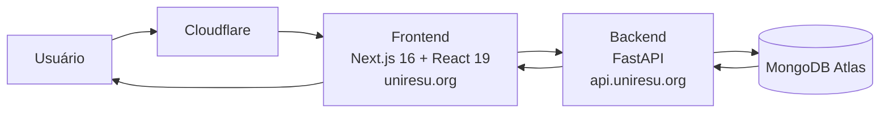

# Arquitetura da Solução

## Diagrama de Classes

## Modelo ER (Projeto Conceitual)

## Projeto da Base de Dados

## ATENÇÃO!!!

Os três artefatos — **Diagrama de Classes, Modelo ER e Projeto da Base de Dados** — devem ser desenvolvidos de forma sequencial e integrada, garantindo total coerência e compatibilidade entre eles. O diagrama de classes orienta a estrutura e o comportamento do software; o modelo ER traduz essa estrutura para o nível conceitual dos dados; e o projeto da base de dados materializa essas definições no formato físico (tabelas, colunas, chaves e restrições). A construção isolada ou desconexa desses elementos pode gerar inconsistências, dificultar a implementação e comprometer a qualidade do sistema.

## Tecnologias Utilizadas

| Camada         | Tecnologias                                      |
| -------------- | ------------------------------------------------ |
| Frontend       | Next.js 16, React 19                             |
| Backend        | FastAPI                                          |
| Banco de Dados | MongoDB Atlas                                    |
| Infraestrutura | Docker, Render, Cloudflare                       |

## Hospedagem

- **Aplicação (produção)**: [https://uniresu.org/](https://uniresu.org/)
- **API (Swagger/OpenAPI)**: [https://api.uniresu.org/docs](https://api.uniresu.org/docs)
