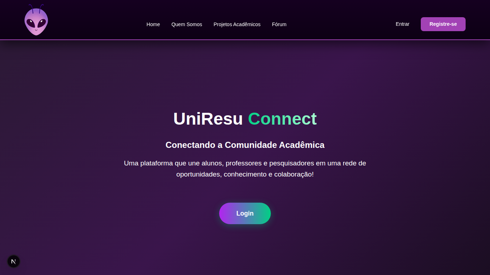
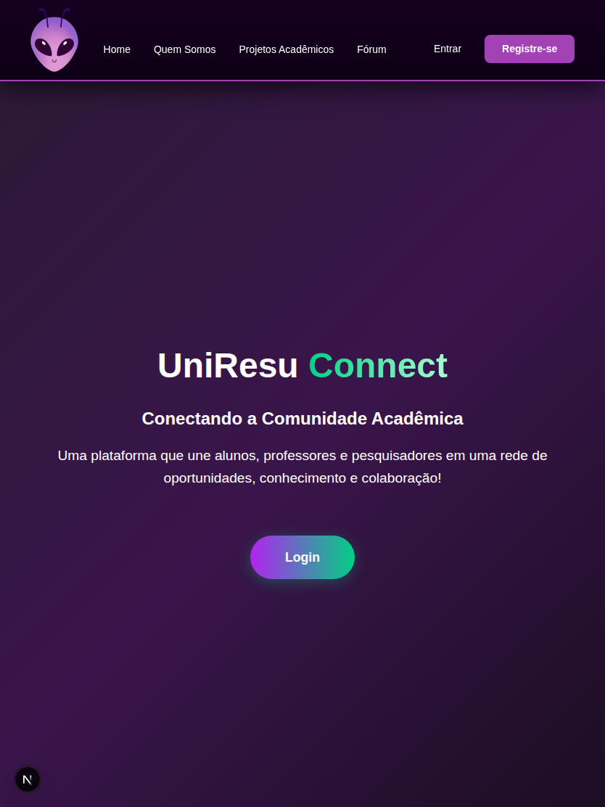
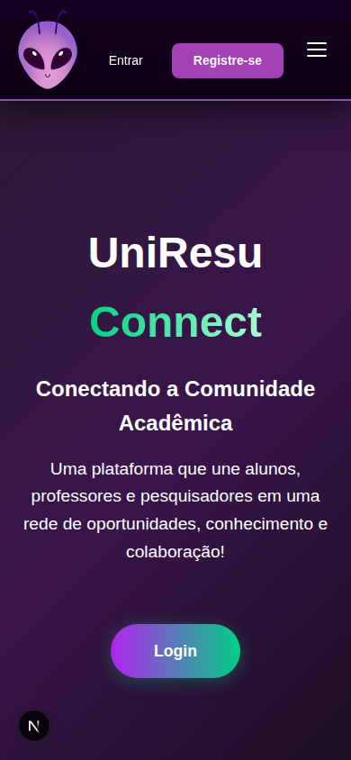
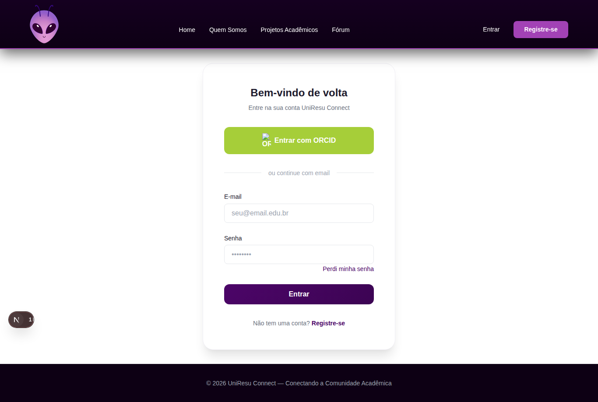

# Template Padrão da Aplicação

Pré-requisitos: [Especificação do Projeto](02-Especificação%20do%20Projeto.md), [Projeto de Interface](04-Projeto%20de%20Interface.md), [Metodologia](03-Metodologia.md)

Este documento descreve o template visual realmente aplicado no frontend Next.js do UniResu Connect, com base em `frontend/src/app/globals.css`, `frontend/src/components/layout/Navbar.module.css` e `frontend/src/app/layout.tsx`.

## 1) Identidade visual real (frontend)

### 1.1 Paleta de cores

Tokens globais definidos em `globals.css`:

- **Primária**: `#4c0568` (`--primary`)
- **Primária clara**: `#a242b5` (`--primary-light`)
- **Primária escura**: `#3c0453` (`--primary-dark`)
- **Destaque/Accent**: `#a242b5` (`--accent`) e `#dd43e6` (`--accent-hover`)
- **Fundos**: `#ffffff`, `#f8f7fc`, `#f4f2f9`, `#1a1025`
- **Texto**: `#1e1b2e`, `#6b7280`, `#9ca3af`, `#ffffff`
- **Bordas e estados**: `#e5e7eb`, `#f0eef5`, `#10b981`, `#f59e0b`, `#ef4444`

Aplicação prática no layout padrão:

- **Header/Navbar**: gradiente `#150020 → #0d0014`, borda inferior `#a242b5`
- **Footer**: fundo `#0d0014` e texto `#9ca3af`

### 1.2 Tipografia

- Fonte base global: **Inter** (Google Fonts), com fallback para `-apple-system`, `BlinkMacSystemFont`, `Segoe UI` e `sans-serif`.
- Escala tipográfica definida por variáveis CSS (`--font-size-xs` até `--font-size-4xl`).
- No header, a marca usa peso forte (`font-weight: 800`) e espaçamento entre letras para reforçar identidade.

### 1.3 Iconografia

O sistema atual combina:

- **Logo raster oficial** no topo: `frontend/public/uniresulogo.png`
- **Ícones textuais/emoji** na navegação e ações (ex.: `👤 Perfil`, `📋 Meus Projetos`, `📄 Candidaturas`, `🚪 Sair`)

Não há biblioteca externa de ícones no frontend neste momento; o padrão visual em produção usa esse conjunto.

## 2) Layout padrão aplicado em todas as páginas

Estrutura global definida em `frontend/src/app/layout.tsx`:

1. **Header** fixo no topo (com menu de navegação)
2. **Main** com conteúdo da rota
3. **Footer** institucional no final da página

> Observação: o sistema usa menu superior e menu hamburguer em telas menores; não há sidebar lateral fixa no template global atual.

### Capturas reais do layout

**Desktop (menu horizontal + header padrão):**

**Tablet (adaptação de espaçamento e densidade):**

**Mobile (header com menu hamburguer):**

**Footer institucional no template global:**

## 3) Comportamento responsivo (com breakpoints)

Breakpoints identificados nos CSS Modules:

- **Mobile principal: `max-width: 640px`**  
  Usado em páginas de projetos, candidaturas, perfil, edição de perfil, fórum e cadastro.
- **Menu responsivo: `max-width: 768px`**  
  Na `Navbar`, oculta os links horizontais e ativa o menu hamburguer.
- **Ajuste de layout ampliado: `min-width: 900px`**  
  Usado na home para reorganização de seções em telas maiores.

Resumo por eixo:

- **Mobile (≤640px)**: componentes empilhados, formulários e cards com menor espaçamento.
- **Tablet (641px–768px)**: transição de densidade; header já utiliza comportamento mobile da navbar.
- **Desktop (≥769px)**: menu horizontal completo e maior aproveitamento de largura.

## 4) Logo e escolhas visuais

O logo (`uniresulogo.png`) aparece no header em destaque e ancora a navegação para a Home.  
A direção visual privilegia tons escuros de roxo e preto no topo/rodapé (estética acadêmica e tecnológica), com roxo vibrante para ações e estados de destaque.  
Esse contraste melhora legibilidade, mantém consistência entre páginas e reforça a identidade do UniResu Connect.
